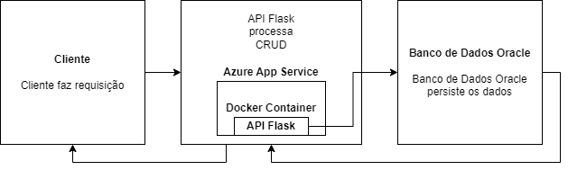

# API Flask com Banco de Dados Oracle em Nuvem - Gestão de Clientes e Pedidos

## 1) Breve Descrição da Solução

Esta solução consiste em uma **API RESTful** desenvolvida em **Python**, utilizando o framework **Flask** para a construção da aplicação web, e o **SQLAlchemy** para o mapeamento objeto-relacional (ORM). A API gerencia dados de **Clientes** e **Pedidos**, onde cada cliente pode ter um ou mais pedidos associados.

O banco de dados utilizado é o **Oracle**, hospedado na nuvem, garantindo a persistência dos dados. A solução é conteinerizada utilizando **Docker**, o que facilita seu deploy em ambientes de produção, especialmente em plataformas de nuvem como **Azure App Service**.

A API implementa operações de **CRUD (Create, Read, Update, Delete)**, permitindo:
- **Clientes**: Adicionar, listar, atualizar e remover clientes.
- **Pedidos**: Adicionar, listar, atualizar e remover pedidos associados a clientes.

### Arquitetura da Solução:



## 2) Benefícios para o Negócio

A solução proposta oferece diversos benefícios para o negócio, principalmente no que diz respeito à automação e escalabilidade. Entre os principais benefícios estão:

- **Centralização do Gerenciamento de Clientes e Pedidos**: Através de uma interface simples, a empresa pode gerenciar clientes e seus respectivos pedidos de forma eficiente, mantendo todas as informações centralizadas.
  
- **Escalabilidade**: O uso de uma API RESTful na nuvem permite que a aplicação seja facilmente escalada para atender a uma quantidade crescente de clientes e pedidos, com alta disponibilidade.

- **Facilidade de Integração**: Por ser uma API RESTful, a solução pode ser facilmente integrada com outros sistemas e plataformas, como interfaces web, aplicativos mobile, ou sistemas de gestão legados, proporcionando flexibilidade no uso.

- **Segurança e Persistência de Dados**: Com o banco de dados Oracle em nuvem, a empresa pode garantir que os dados dos clientes e pedidos estejam seguros, com backups regulares e alta confiabilidade.

- **Automatização de Processos**: Através do CRUD completo, as operações manuais com dados são minimizadas, aumentando a produtividade e reduzindo erros humanos.

## 3) DDL das Tabelas

### Arquivo: `script.sql`

Este arquivo contém os comandos SQL para a criação das tabelas **Clientes** e **Pedidos** no banco de dados Oracle, juntamente com seus relacionamentos e restrições:

```sql
-- Tabela Clientes (Master)
CREATE TABLE Clientes (
    id_cliente NUMBER PRIMARY KEY,                     -- Identificador único do cliente
    nome_cliente VARCHAR2(100),                        -- Nome completo do cliente
    email_cliente VARCHAR2(100),                       -- Email do cliente
    telefone_cliente VARCHAR2(15)                      -- Telefone de contato do cliente
);

-- Tabela Pedidos (Detail)
CREATE TABLE Pedidos (
    id_pedido NUMBER PRIMARY KEY,                      -- Identificador único do pedido
    descricao_pedido VARCHAR2(255),                    -- Descrição do pedido
    valor_pedido NUMBER,                               -- Valor total do pedido
    id_cliente NUMBER,                                 -- ID do cliente associado ao pedido
    CONSTRAINT fk_cliente FOREIGN KEY (id_cliente)     -- Chave estrangeira associando o pedido ao cliente
    REFERENCES Clientes(id_cliente)
);

-- Inserção de dados de teste na tabela Clientes
INSERT INTO Clientes (id_cliente, nome_cliente, email_cliente, telefone_cliente)
VALUES (1, 'Maria Silva', 'maria@email.com', '123456789');

-- Inserção de dados de teste na tabela Pedidos
INSERT INTO Pedidos (id_pedido, descricao_pedido, valor_pedido, id_cliente)
VALUES (1, 'Pedido de Maria', 100.50, 1);
```

O arquivo completo para execução no banco de dados pode ser encontrado no repositório no arquivo `script.sql`.

## 4) Código Fonte e Instruções para Deploy

### Pré-requisitos:
- **Python 3.x** instalado na máquina.
- **Docker** (caso deseje rodar a aplicação em container).
- **Banco de Dados Oracle** configurado na nuvem.
- **Azure App Service** ou outro serviço para deploy na nuvem (opcional).

### Estrutura do Repositório:

- `app.py`: Código fonte principal da API.
- `requirements.txt`: Dependências do projeto.
- `Dockerfile`: Arquivo de configuração Docker para conteinerização.
- `script.sql`: DDL para criação das tabelas no banco de dados Oracle.

### Como Rodar a Aplicação Localmente:

1. **Clone o Repositório**:

   ```bash
   git clone <URL-do-repositorio>
   cd nome-do-projeto
   ```

2. **Crie e Ative um Ambiente Virtual** (opcional, mas recomendado):

   ```bash
   python -m venv venv
   source venv/bin/activate  # Linux/Mac
   venv\Scriptsctivate  # Windows
   ```

3. **Instale as Dependências**:

   ```bash
   pip install -r requirements.txt
   ```

4. **Configure a String de Conexão do Banco de Dados**:

   Edite o arquivo `app.py` e atualize a variável `DATABASE_URL` com a sua string de conexão para o banco de dados Oracle em nuvem:

   ```python
   DATABASE_URL = "oracle+oracledb://<usuario>:<senha>@<host>:1521/<service_name>"
   ```

5. **Execute a Aplicação Localmente**:

   ```bash
   python app.py
   ```

   A API estará disponível em `http://127.0.0.1:5000`.

### Como Rodar a Aplicação usando Docker:

1. **Construa a Imagem Docker**:

   ```bash
   docker build -t seu-usuario/api-flask-oracle .
   ```

2. **Rode o Container**:

   ```bash
   docker run -d -p 5000:5000 seu-usuario/api-flask-oracle
   ```

3. **Acesse a API** em `http://127.0.0.1:5000` ou `http://localhost:5000`.

### Como Fazer o Deploy na Nuvem (Azure App Service):

1. **Publicação via Azure App Service**:
   - Vá para o portal do **Azure** e crie um novo **App Service**.
   - Escolha a **Runtime Stack** como **Python 3.9**.
   - Configure as variáveis de ambiente, incluindo a string de conexão `DATABASE_URL`.

2. **Publicação via Docker**:
   - Configure o App Service para usar a imagem Docker criada e faça o deploy diretamente.

3. **Testes da API na Nuvem**:
   - Use ferramentas como **Postman** ou `curl` para testar os endpoints da API hospedada no Azure.

### Exemplos de Requisições JSON (para o CRUD da API):

- **POST /clientes**:
  ```json
  {
    "id_cliente": 2,
    "nome_cliente": "João Pereira",
    "email_cliente": "joao@email.com",
    "telefone_cliente": "987654321"
  }
  ```

- **PUT /clientes/{id_cliente}**:
  ```json
  {
    "nome_cliente": "João Pereira Atualizado",
    "email_cliente": "joao.atualizado@email.com",
    "telefone_cliente": "999999999"
  }
  ```

- **POST /pedidos**:
  ```json
  {
    "id_pedido": 2,
    "descricao_pedido": "Pedido de João",
    "valor_pedido": 200.75,
    "id_cliente": 2
  }
  ```

### Como Testar a API Usando Postman:

- **GET** `/clientes`: Lista todos os clientes.
- **POST** `/clientes`: Adiciona um novo cliente com o JSON fornecido no corpo da requisição.
- **PUT** `/clientes/{id_cliente}`: Atualiza os dados de um cliente.
- **DELETE** `/clientes/{id_cliente}`: Deleta um cliente.
- **GET** `/pedidos`: Lista todos os pedidos.
- **POST** `/pedidos`: Adiciona um novo pedido.
  
---

## 5) Conclusão

Esta solução implementa uma API funcional com banco de dados Oracle na nuvem, permitindo o gerenciamento de clientes e pedidos via operações CRUD. A solução é escalável e pode ser facilmente implantada em plataformas de nuvem como o **Azure App Service**. O código está disponível no repositório e pode ser facilmente clonado e executado localmente ou em containers Docker.

---

### Links importantes:

- **Repositório GitHub**: [https://github.com/gusoaresf/DevOps---Golden-Data]
- **Link para o Vídeo Demonstrativo**: [https://www.youtube.com/watch?v=bKjapK8USwE]